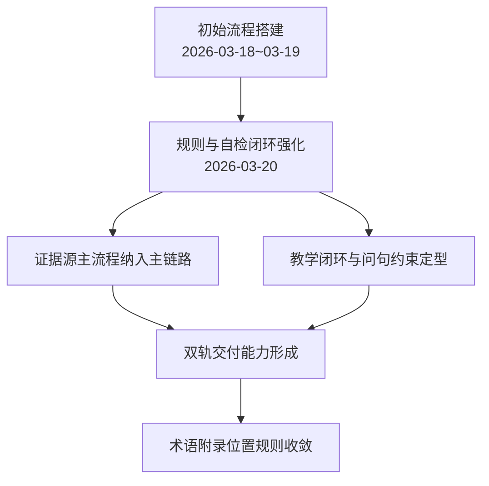

transcript-refine 版本变更文档

---

## 一、文档目的

- 记录 `transcript-refine` skill 的可追溯版本演进，便于后续维护、回滚与规则对齐。
- 本文依据：
  - 以仓库中对 `/.agent/skills/transcript-refine/SKILL.md` 的提交历史（`git log --follow -- .agent/skills/transcript-refine/SKILL.md`）为主，用于还原**能力与规则如何随版本演化**；
  - `SKILL.md` 当前正文视为「当下生效规则」快照，可与历史对照

  本文在该历史基础上整理为阶段级摘要，不逐条复述每次提交。

---

## 二、版本时间线（粗粒度）

- **2026-03-18 ~ 03-19**：初版主流程（保序、纠错、去重、取舍边界）。
- **2026-03-20**：规则与自检对齐；证据源主流程；案例/引用/教学闭环与缩写等规则收敛。
- **2026-03-21**：阅读稿与口播稿双轨、主语与问句约束强化；术语附录位置定型。

---

## 三、阶段性演进摘要（STAR）

### 3.1 初始建设阶段（2026-03-18 ~ 2026-03-19）

- **S（Situation）**：原始视频转写稿口语噪声多、重复多、术语混乱，直接学习成本高。
- **T（Task）**：先建立可稳定复用的“视频文稿 -> 精炼学习稿”主流程，满足首次学习可读性。
- **A（Action）**：
  - 建立保序、纠错、去重的基础规则骨架。
  - 按“保留知识、去除噪声”定义首版取舍边界。
  - 持续迭代“视频文稿精炼”相关提交，沉淀可执行流程。
- **R（Result）**：形成可运行的初版 skill，为后续规则闭环和双轨分化提供稳定基础。

### 3.2 规则闭环强化阶段（2026-03-20）

- **S（Situation）**：规则项增多后，出现“定义有了但验收口径不一致”的执行歧义风险。
- **T（Task）**：让“规则定义”与“质量自检”一一对应，提升执行一致性与可追溯性。
- **A（Action）**：
  - 引入并强化证据源主流程（PDF/TXT/代码自动扫描、优先级处理、来源标注）。
  - 统一案例展示层级与引用块格式，确保案例与原理可回收。
  - 调整教学闭环约束，兼容概念型小节并同步自检项。
- **R（Result）**：规则与自检形成闭环，纠错依据更透明，执行偏差显著收敛。

### 3.3 双稿分轨与结构定型阶段（2026-03-21）

- **S（Situation）**：同一知识需服务“阅读学习”与“口播传播”两种消费场景，单一文风难兼顾。
- **T（Task）**：在不损失知识一致性的前提下，明确双轨交付边界并固化结构规范。
- **A（Action）**：
  - 明确阅读稿/口播稿的触发方式、表达边界与命名建议。
  - 强化“主语显性化 + 带主语问句”约束，降低章节歧义。
  - 固化“术语速查附录置于文末”的位置规则，避免打断主线。
- **R（Result）**：形成“同源知识、双轨表达”的稳定模式，结构一致性与使用可预期性提升。

---

## 四、关键变更与影响分析

### 4.1 证据源主流程

- 变更点：
  - 将“是否存在外部证据源”的扫描纳入主流程必经步骤。
  - 统一来源标注最小格式（PDF 页码 / TXT 行号 / 代码定位）。
- 影响：
  - 优点：术语纠错与参数还原的准确性提升，结论可追溯。
  - 风险：执行成本增加；若证据源质量差，可能出现口径冲突，需要按优先级裁决。

### 4.2 教学闭环与问句约束

- 变更点：
  - 要求小节以带主语问句展开，强调“场景->动机->方法->结果/边界”。
  - 放宽纯概念小节的硬性模板，保留最小问句集。
- 影响：
  - 优点：对小白更友好，减少“知道术语但不懂为什么/怎么用”的断层。
  - 风险：若执行不当，可能造成句式模板化；需在“结构完整”和“自然表达”间平衡。

### 4.3 双轨交付

- 变更点：
  - 区分阅读稿（清晰、连贯、定论）与口播稿（听感、代入、节奏）。
- 影响：
  - 优点：同源知识可覆盖不同学习/传播场景。
  - 风险：若边界不清，可能出现“阅读稿口播化”或“口播稿过度文书化”。

### 4.4 文档结构定型

- 变更点：
  - 强制术语速查类内容统一放在全文最后的附录章节。
- 影响：
  - 优点：主线连续性更强，降低中段插入“字典区”带来的阅读中断。
  - 风险：若附录过长，读者跳转成本上升；需控制附录只放必要口径项。

---

## 五、演进关系图

---

## 六、当前版本特征（基于 SKILL.md 现状）

- 面向“首次学习”而非复习，强调知识完整性优先。
- 结构上要求保序、纠错、去重，并通过问句化组织提升可学习性。
- 内容上支持阅读稿/口播稿双轨，且对语气和表达边界有明确约束。
- 流程上把证据源增强作为主流程步骤，强化可追溯纠错。
- 质量上通过自检清单闭环规则执行，减少产物偏差。

---

## 七、后续维护建议

- 新增规则时同步新增对应自检项，防止“规则新增但不可验收”。
- 变更提交信息尽量采用“动词 + 影响对象 + 目的”，便于后续审计。
- 对高频争议点（如问句模板密度、双稿边界）保留最小反例，减少执行歧义。

